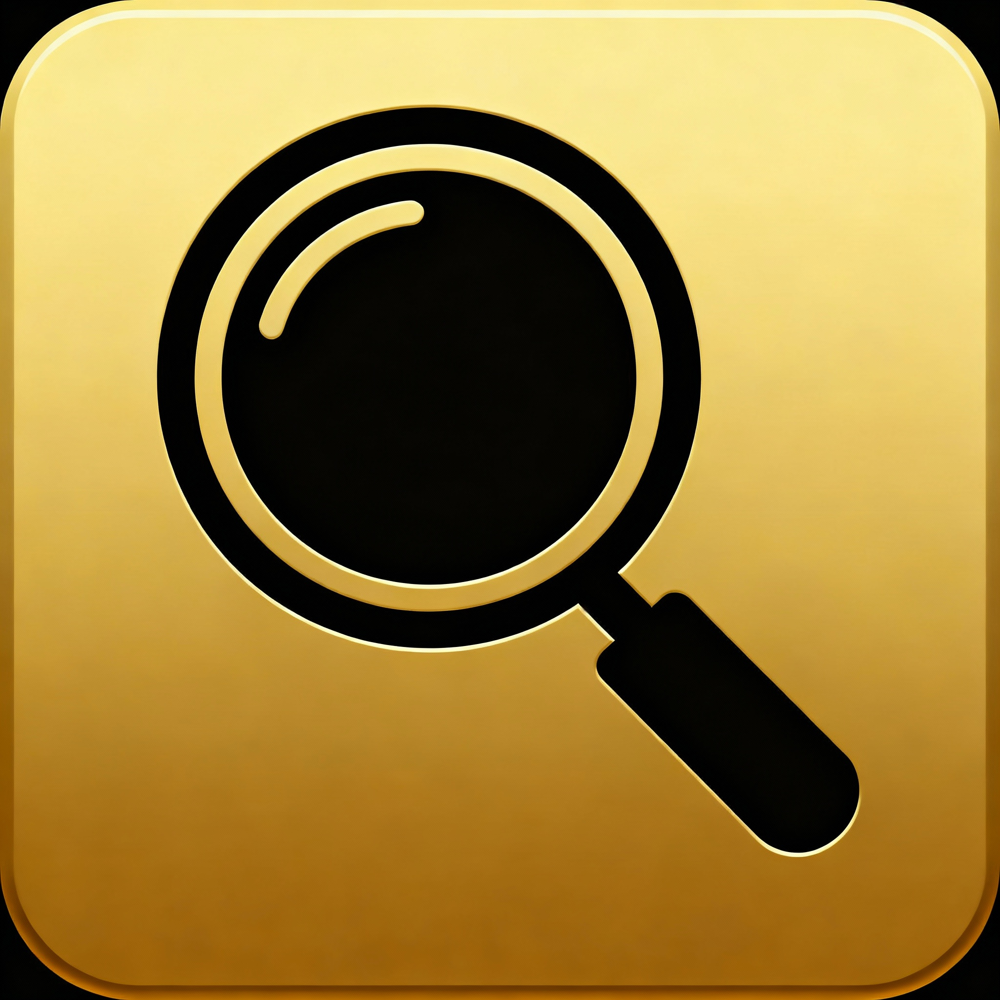

# 🎯 BiSFinder

**Find the best gear for your specialization in World of Warcraft**

---

## 📖 Description

**BiSFinder** is a World of Warcraft addon that helps players find the best gear (Best-in-Slot) for their class and specialization.

### ✨ Key Features

- 🎮 **Automatic specialization detection** — the addon automatically detects your current specialization
- 🎯 **Role filtering** — Tank, DPS, Healer
- 🏆 **Item information** — item IDs, names, sources
- 🗺️ **Minimap icon** — quick access to the addon interface

## 🚀 Installation

### Via CurseForge (Recommended)
1. Go to the [addon page on CurseForge](https://www.curseforge.com/wow/addons/bisfinder)
2. Click "Install" or "Download"
3. The addon will automatically install via CurseForge App

### Manual Installation
1. Download the latest version from [Releases](https://github.com/yourusername/BiSFinder/releases)
2. Extract the archive to `World of Warcraft\_retail_\Interface\AddOns\`
3. Make sure the folder is named `BiSFinder`
4. Restart the game

## 🎮 Usage

### Launching the Addon
- **Chat command**: `/bisfinder` or `/bisf` — automatically opens content for your specialization
- **Minimap icon**: click on the addon icon
- **Minimap commands**:
  - `/bisfinder minimap show` — show icon
  - `/bisfinder minimap hide` — hide icon
  - `/bisfinder minimap toggle` — toggle visibility

### Addon Interface

The addon automatically detects your current specialization and shows the corresponding content. You can switch to any other role or specialization.

#### 🎯 Role Selection
Choose your role in the game:
- **🛡️ Tank** — tank
- **⚔️ DPS** — damage dealer
- **💚 Healer** — healer

#### 🎭 Specialization Selection
After selecting a role, choose a specialization from the list available for the selected class.

#### 📋 Gear Viewing
The addon will display a list of recommended gear with information about:
- **Item type** (helmet, chest, weapon, etc.)
- **Item name**
- **Source** (raid, dungeon, PvP, etc.)

## 🔧 Compatibility

- **WoW Version**: 11.2.0+
- **Interface**: 11200

## 📞 Support

- **CurseForge**: [Addon page](https://www.curseforge.com/wow/addons/bisfinder)

---

**Made with ❤️ for the World of Warcraft community**

